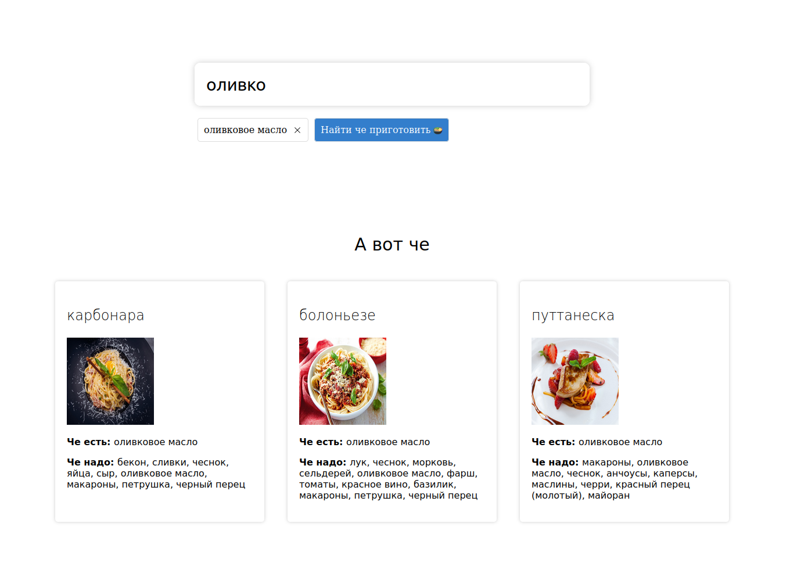

# Холодос



>Напишите, что у вас в холодильнике, а мы предложим, что из этого можно приготовить

Демо проекта на [Render](https://holodos-back.onrender.com)

В этом репозитории представлена клиентская часть приложения

Приложение лежит на бесплатном сервере для разработчиков Render. Чтобы его посмотреть, нужно открыть ссылку и подождать около минуты, пока оно запустится.

## Технологии

**Клиент:** Vue + Element Plus

**Сервер:** Spring Boot + Hibernate

**База данных:** PostgresQL

## Использование

### Запуск java-сборки 📥

```sh
cd docs
java -jar holodos-0.0.1-SNAPSHOT.jar
```
### Загрузка ресурсов 📥

```sh
npm install
```

### Запуск

```sh
npm run dev
```

### Сборка

```sh
npm run build
```
## Автор

👤 **Artem Bogdanov**

* Github: [@Temror](https://github.com/Temror)
* Telegram: [@TemaBogdanov](https://t.me/temabogdanov)
